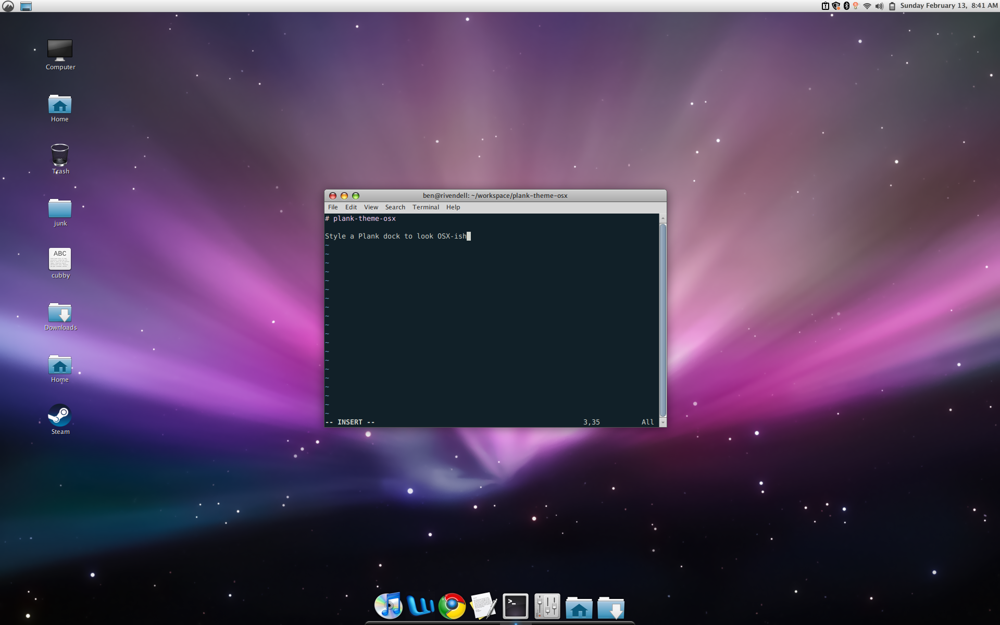

# plank-theme-osx

Style a Plank dock to look OSX-ish.



## Installation

1. Install Plank with something like `apt install plank`
2. Symlink the theme into `/usr/share/plank/themes/osx`:
   ```sh
   sudo mkdir /usr/share/plank/themes/osx
   sudo ln -s /path/to/this/repo/dock.theme /usr/share/plank/themes/osx/dock.theme
   ```
3. Run Plank if you haven't already. Ctrl-right-click the dock and select
   "Preferences". Under "Appearance", select the "osx" theme.

## Tips

### Adding folders to the dock

You may be wondering how I got the "Home" and "Downloads" folders into my dock.
Ordinarily, you can only put application launchers in the dock.

The trick is that they _are_ launchers, for `nemo`, the file browser. In
Cinnamon, you can create a desktop launcher by right-clicking the desktop. Set
the command to something like `nemo /home/ben/Downloads` and choose an icon.
You can then drag the launcher onto the dock.

### Moving the Cinnamon panel out of the way

By default, Cinnamon displays a "panel" (similar to the Windows taskbar) at the
bottom of the screen. You probably want to move this to the top.

In `dconf-editor`, change `org.cinnamon.panels-enabled` from `['1:0:bottom']`
to `['1:0:top']`.

Since the dock now shows your open applications, you probably don't need the panel to do that as well. Edit `org.cinnamon.enabled-applets` and remove `grouped-window-list@cinnamon.org` from the array.
